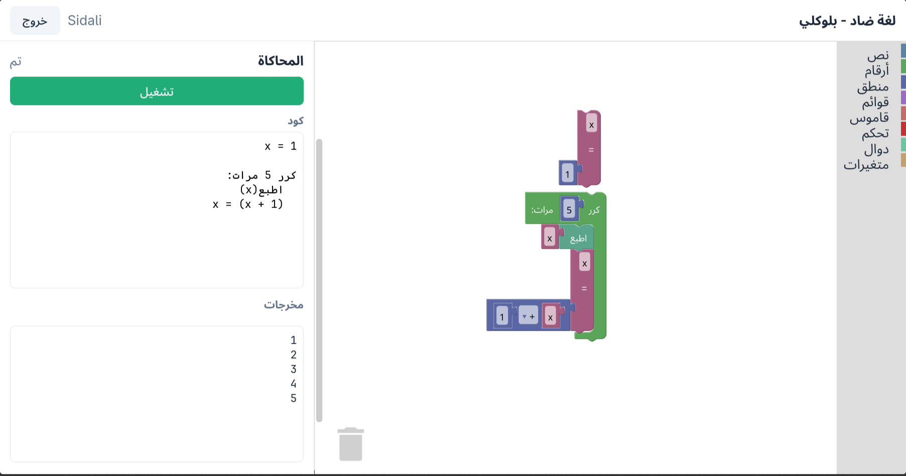

<div dir="rtl" align="right">

# ضاد بلوكلي (Daad Blockly) - منصة البرمجة البصرية

تطبيق ويب تفاعلي للبرمجة البصرية بلغة "ضاد" العربية، مبني على بيئة Google Blockly.

## مقدمة

يوفر هذا التطبيق بيئة برمجية ممتعة وسهلة الاستخدام تعتمد على مبدأ "السحب والإفلات" (Drag and Drop). تم تصميم الواجهة لتدعم اللغة العربية بشكل كامل مع اتجاه اليمين إلى اليسار (RTL)، مما يجعله أداة مثالية لتعلم مفاهيم البرمجة وكتابة الأكواد بلغة "ضاد" وتجربتها مباشرة دون الحاجة للقلق حول أخطاء بناء الجملة (Syntax errors).

## المميزات

- **برمجة بصرية تفاعلية:** بناء البرامج بسهولة عبر سحب وإفلات الكتل البرمجية.
- **محرر أكواد مدمج:** إمكانية عرض وتعديل الأكواد النصية مباشرة بلغة "ضاد".
- **دعم أصلي للعربية:** واجهة مستخدم (UI) مصممة بالكامل من اليمين إلى اليسار لراحتك.
- **نظام حسابات:** تسجيل الدخول وإنشاء حسابات شخصية لحفظ مشاريعك وإدارتها.
- **حفظ تلقائي:** يتم حفظ تقدمك تلقائياً في قاعدة البيانات لضمان عدم ضياع عملك.
- **تنفيذ فوري:** تشغيل الأكواد البرمجية مباشرة من المتصفح واستعراض المخرجات لحظياً.

## لقطات الشاشة

### واجهة التطبيق الرئيسية (مساحة العمل)



## كيف يعمل التطبيق؟

تعتمد معمارية التطبيق على ثلاث مراحل رئيسية مترابطة لتحويل الكتل البصرية إلى برنامج فعّال يعمل بلغة ضاد:

### 1. واجهة البرمجة البصرية (Visual Editor)

واجهة المستخدم مبنية باستخدام مكتبة **Google Blockly**، حيث تم تخصيص وبناء كتل برمجية (Blocks) تعكس وتدعم مفاهيم لغة ضاد. يتم تنظيم تعريفات هذه الكتل داخل مسار `assets/js/blocks/`، وهي مقسمة منطقياً إلى الوحدات التالية:

<div dir="rtl" align="left">

- **`control.js`**: أدوات التحكم في مسار البرنامج مثل الجمل الشرطية (if) وحلقات التكرار (while, for).
- **`logic.js`**: العمليات المنطقية والمقارنات (و، أو، ليس).
- **`math.js`**: العمليات الحسابية المتنوعة.
- **`variables.js`**: تعريف المتغيرات وإسناد واسترجاع قيمها.
- **`functions.js`**: إنشاء الدوال البرمجية المخصصة واستدعاؤها.
- **`lists.js`**: إدارة المصفوفات والقوائم (الإنشاء، الإضافة، الحذف).
- **`io.js`**: عمليات الإدخال والإخراج (مثل الطباعة على الشاشة).
- **`toolbox.js`**: إعدادات الهيكل التنظيمي الذي يعرض الكتل كقائمة جانبية للمستخدم.
</div>

### 2. محرك توليد الأكواد (Code Generator)

بمجرد أن يقوم المستخدم بترتيب الكتل في مساحة العمل، يتدخل محرك التوليد الموجود في ملف `assets/js/generator/index.js`. وظيفته هي تحليل الهيكل البصري وترجمته برمجياً إلى كود نصي سليم وقابل للتنفيذ بلغة "ضاد".

### 3. بيئة التنفيذ (Execution Engine)

هنا يأتي دور الواجهة الخلفية (Backend) لتشغيل الكود:

- يقوم متصفح المستخدم بإرسال الكود المُولد عبر طلب `JavaScript` إلى نقطة النهاية (API) عبر المسار: `api.php?action=run`.
- في الخادم (Server)، تستقبل الدالة `runDaad()` (الموجودة في ملف `_bootstrap.php`) هذا الطلب، وتقوم بتمرير الكود النصي إلى مُفسّر لغة ضاد المحلي الموجود في المسار `bin/daad`.
- أخيراً، يتم التقاط مخرجات البرنامج من المُفسّر (سواء كانت نتائج صحيحة `stdout` أو أخطاء برمجية `stderr`) وإعادتها فوراً لتُعرض للمستخدم في واجهة التطبيق.

## المتطلبات الأساسية

لتشغيل المشروع محلياً ستحتاج إلى:

<div dir="ltr" align="left">

- **Docker Engine** و **Docker Compose**
- لا تحتاج إلى تثبيت PHP أو MySQL محلياً
- لا يحتاج التطبيق إلى اتصال بالإنترنت أثناء التشغيل بعد تنزيل المشروع

</div>

## دليل التثبيت والتشغيل

### الخطوة 1: تثبيت المتطلبات

تأكد من تثبيت Docker و Docker Compose على جهازك:

<div dir="ltr" align="left">

**على Linux:**

```bash
# تثبيت Docker
curl -fsSL https://get.docker.com -o get-docker.sh
sudo sh get-docker.sh

# تثبيت Docker Compose
sudo apt-get install -y docker-compose
```

**على Windows/Mac:**

- حمّل [Docker Desktop](https://www.docker.com/products/docker-desktop)
- يتضمن Docker و Docker Compose

</div>

### الخطوة 2: الحصول على المشروع

<div dir="ltr" align="left">

```bash
# اختر أحد الخيارات:

# الخيار 1: استنساخ من Git
git clone https://github.com/Sidali-Djeghbal/daad-blockly.git
cd daad

# الخيار 2: تحميل الملفات يدويّاً
# انسخ جميع ملفات المشروع إلى مجلد محلي
cd daad
```

</div>

### الخطوة 3: إعداد ملف البيئة

انسخ ملف الإعدادات الافتراضي وقم بتعديل القيم حسب رغبتك:

<div dir="ltr" align="left">

```bash
cp .env.example .env
# افتح .env وعدل بيانات قاعدة البيانات
```

</div>

### الخطوة 4: تشغيل التطبيق

<div dir="ltr" align="left">

```bash
# من داخل مجلد المشروع
docker compose up --build
```

</div>

**ماذا يحدث:**

- يتم تحميل صور Docker (MySQL و PHP Apache)
- يتم إنشاء شبكة وتخزين قاعدة البيانات
- يتم تهيئة قاعدة البيانات تلقائياً بالجداول المطلوبة
- يبدأ الخادم على المنفذ 8080

### الخطوة 5: الوصول للتطبيق

<div dir="ltr" align="left">

افتح متصفحك وتوجه إلى:

```
http://localhost:8080/
```

</div>

**الخطوة الأولى:** سيُطلب منك إنشاء حساب جديد ← سجل دخولك ← ابدأ البرمجة

## استكشاف الأخطاء والحلول

<div dir="ltr" align="left">

### المشكلة: لا يمكن الوصول إلى `http://localhost:8080`

**الحل:**

```bash
# تحقق من حالة الحاويات
docker compose ps

# اعرض سجلات الأخطاء
docker compose logs daad_web

# تأكد من أن المنفذ 8080 غير مستخدم
# على Linux:
lsof -i :8080
```

### المشكلة: قاعدة البيانات لا تتهيأ

**الحل:**

```bash
# احذف البيانات القديمة وأعد التشغيل
docker compose down -v
docker compose up --build
```

### المشكلة: أخطاء الصلاحيات على Linux

**الحل:**

```bash
# أضف مستخدمك لمجموعة docker
sudo usermod -aG docker $USER
# أعد تسجيل الدخول أو شغّل:
newgrp docker
```

</div>

## إيقاف التطبيق

<div dir="ltr" align="left">

```bash
# إيقاف الحاويات والاحتفاظ بالبيانات
docker compose down

# إيقاف الحاويات ومسح البيانات
docker compose down -v
```

</div>

## قاعدة البيانات

يقوم Compose بإنشاء قاعدة البيانات والجداول تلقائياً عند أول تشغيل. البيانات محفوظة في `daad_db_data` volume ولا تُحذف إلا عند تشغيل `docker compose down -v`.

<div dir="ltr" align="left">

**للوصول المباشر لقاعدة البيانات:**

```bash
docker compose exec db mysql -u daad_user -p daad_app
# ادخل كلمة المرور: daad_password
```

</div>

## الكتل البرمجية المدعومة

يوفر التطبيق مجموعة واسعة من الكتل لبناء برامجك:

### الإدخال والإخراج

- اطبع (لإظهار النتائج).
- ادخل _(قريباً إن شاء الله)_.

### الرياضيات

- العمليات الأساسية: جمع، طرح، ضرب، قسمة.
- مقارنة الأرقام والقيم.
- أس وباقي القسمة _(قريباً إن شاء الله)_.

### المنطق

- الجمل الشرطية: إذا (if)، وإلا (else)، وإلا إذا (else if).
- المعاملات المنطقية: و (and)، أو (or)، ليس (not).
- القيم المنطقية: صحيح (true)، خطأ (false).

### حلقات التكرار

- طالما (while).
- كرر (repeat).
- لكل (for each).

### القوائم (المصفوفات)

- أنشئ قائمة جديدة.
- الوصول لعنصر محدد.
- أضف عنصراً.
- أزل عنصراً.
- حساب طول القائمة.

### الدوال

- إنشاء دالة (وظيفة مخصصة).
- إرجاع قيمة (Return).
- استدعاء دالة.

### المتغيرات

- عرِّف متغيِّراً.
- احصل على قيمة متغير.
- غيّر قيمة متغير.

## شكر و تقدير

- **لغة ضاد:** الشكر موصول لمنظمة [daadLang](https://github.com/daadLang) على تطوير لغة البرمجة العربية.
- **مكتبة Blockly:** يعتمد هذا المشروع على المكتبة مفتوحة المصدر [Google Blockly](https://developers.google.com/blockly).

## المساهمة

نرحب دائماً بمساهماتكم! سواء كان ذلك من خلال إصلاح الأخطاء (Bug Fixes)، إضافة ميزات وكتل جديدة، أو حتى تحسين التوثيق. لا تتردد في فتح طلب سحب (Pull Request) أو الإبلاغ عن مشكلة عبر (Issues).

## الرخصة

هذا المشروع مفتوح المصدر ومرخص بموجب رخصة **Apache-2.0**. يرجى مراجعة ملف [LICENSE](LICENSE) لمزيد من التفاصيل.

</div>
